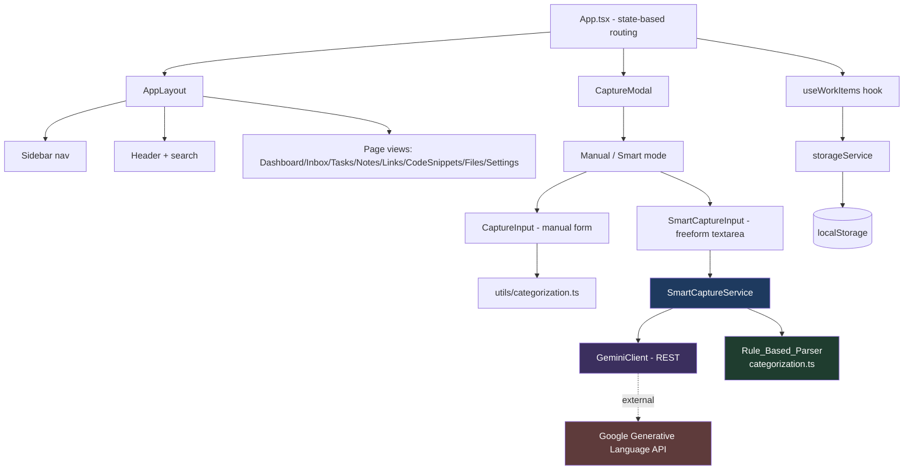
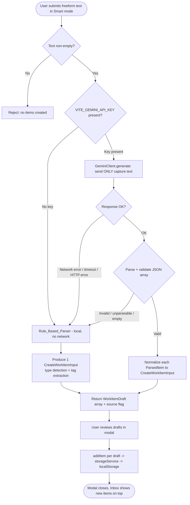

# Design Document

## Overview

WorkPocket is a client-side React + TypeScript application built with Vite and styled with Tailwind CSS. It has no backend, no authentication, and no server-side database. Every captured entry is a single unified `WorkItem` record persisted to the browser's `localStorage`. This design documents the already-built MVP (capture, editing, type-specific views, search, dashboard, and persistence) and specifies the headline AI-core feature, **Smart Capture**, which converts freeform text into one or more structured WorkItems with a graceful rule-based fallback.

The design reflects the actual code as built:

- **Routing is state-based**, not React Router. `App.tsx` holds a `currentView` state (`PageView`) and renders the matching page inside `AppLayout`. Sidebar navigation calls `setCurrentView`.
- **Persistence** is a plain object module `storageService` (in `src/services/storage.ts`) wrapping `localStorage` under key `workpocket_items_v1`, with sample-data seeding on first launch.
- **State orchestration** lives in the `useWorkItems` hook, which loads from storage on mount, mirrors mutations into React state, and derives `filteredItems` and dashboard `stats`.
- **Rule-based detection** already exists in `src/utils/categorization.ts` (`detectItemType`, `extractTags`) and is used live in `CaptureInput` for auto-detection as the user types.
- **Capture** flows through `CaptureModal` → `CaptureInput`, which builds a `CreateWorkItemInput` and calls `onSave` (wired to `addItem`).

Smart Capture is introduced as a new **"Smart" mode** inside the existing `CaptureModal`. It sends only the current freeform text to Google Gemini (`gemini-1.5-flash`) via REST, parses a validated JSON array of items into `WorkItem[]`, and falls back to the existing `Rule_Based_Parser` whenever the AI path is unavailable or unusable. Manual capture is unchanged and remains the default.

### AI Provider Decision and Tradeoffs

- **Provider/model:** Google Gemini `gemini-1.5-flash` over the public Generative Language REST API.
- **API key:** read from the Vite env var `VITE_GEMINI_API_KEY` (configured as a Vercel environment variable). Because Vite inlines `VITE_`-prefixed vars into the client bundle, **this is a client-side (browser) call and the key ships to the browser.** This is an accepted tradeoff for a hackathon MVP using a **free-tier key**; there is no backend to proxy the request. This is documented explicitly so it can be revisited (a serverless proxy would be the production fix).
- **Privacy posture:** only the current capture text is transmitted. Stored WorkItems are never sent. When no key is configured, no network request is made at all and parsing is fully local.

## Architecture

### High-Level Component Diagram



### Smart Capture Data-Flow Diagram



### Layering

| Layer | Responsibility | Modules |
|-------|----------------|---------|
| UI / Presentation | Rendering, navigation, capture forms | `App.tsx`, `components/**`, `pages/**` |
| Application state | Load/mutate items, derive filtered list + stats | `hooks/useWorkItems.ts` |
| Domain parsing | Convert input → structured fields | `utils/categorization.ts` (rule), `services/smartCapture.ts` (new) |
| External client | Gemini REST transport | `services/geminiClient.ts` (new) |
| Persistence | Read/write WorkItems | `services/storage.ts` |

Smart Capture is additive: it introduces `services/smartCapture.ts` and `services/geminiClient.ts` and a Smart-mode UI branch. It reuses `detectItemType`/`extractTags` as the fallback and reuses `useWorkItems.addItem` for persistence, so no existing MVP behavior changes.

## Components and Interfaces

### Existing components (verified, unchanged)

- **`App.tsx`** — state-based router. Owns `currentView`, `isCaptureOpen`, `captureDefaultType`. Registers keyboard shortcuts (`c` opens capture, `/` and `Ctrl+K` focus search). Renders `CaptureModal` with `onSave={addItem}`.
- **`useWorkItems`** — exposes `items`, `filteredItems`, `searchQuery`/`setSearchQuery`, `statusFilter`/`setStatusFilter`, `addItem`, `updateItem`, `deleteItem`, `toggleComplete`, `resetToSampleData`, `stats`.
- **`storageService`** — `getItems`, `saveItems`, `addItem`, `updateItem`, `deleteItem`, `toggleComplete`, `resetToDefault`.
- **`categorization.ts`** — `detectItemType(input): DetectionResult` and `extractTags(content): string[]`.
- **`CaptureModal` / `CaptureInput` / `CaptureTypeSelector`** — manual capture UI producing a `CreateWorkItemInput`.

### New: `SmartCaptureService` (`src/services/smartCapture.ts`)

Orchestrates AI-first parsing with rule-based fallback. Pure orchestration; it does not touch `localStorage` (the UI persists drafts via `addItem`).

```typescript
import { CreateWorkItemInput, WorkItemType } from '../types/workItem';

/** Where the parse result came from — surfaced in UI and metadata. */
export type ParseSource = 'ai' | 'rule';

/** A single normalized draft ready to become a WorkItem, plus provenance. */
export interface WorkItemDraft extends CreateWorkItemInput {
  /** Item_Type resolved by the parser (may be overridden by manual selection). */
  type: WorkItemType;
}

export interface SmartParseResult {
  /** One or more drafts. AI may return several; rule fallback returns exactly one. */
  drafts: WorkItemDraft[];
  /** Which parser produced the drafts. */
  source: ParseSource;
  /** Non-fatal reason the AI path was skipped or failed (for telemetry/UI hint). */
  fallbackReason?: 'no-key' | 'network' | 'timeout' | 'http-error' | 'invalid-json';
}

export interface SmartCaptureOptions {
  /** If the user manually picked a type, force it on every produced draft. */
  forcedType?: WorkItemType;
  /** Timeout for the AI call in ms (default 8000). */
  timeoutMs?: number;
}

export interface SmartCaptureService {
  /** True when VITE_GEMINI_API_KEY is configured (controls whether any network call happens). */
  isAiEnabled(): boolean;

  /**
   * Parse freeform text into one or more drafts.
   * Never throws for expected failures: on any AI failure it falls back to the
   * rule-based parser and returns source: 'rule'.
   */
  parse(text: string, options?: SmartCaptureOptions): Promise<SmartParseResult>;
}

export function createSmartCaptureService(deps?: {
  gemini?: GeminiClient;
  ruleParse?: (text: string, forcedType?: WorkItemType) => WorkItemDraft[];
}): SmartCaptureService;
```

Behavioral contract:

1. If `text.trim()` is empty → return `{ drafts: [], source: 'rule' }` (caller rejects; no WorkItem created).
2. If `isAiEnabled()` is false → call the rule parser, return `source: 'rule'`, `fallbackReason: 'no-key'`, **no network request**.
3. If AI enabled → call `GeminiClient.generateItems(text, timeoutMs)`. On network error/timeout/HTTP error → rule fallback with the matching `fallbackReason`.
4. On AI success → validate the JSON array. If validation fails or yields zero valid items → rule fallback with `fallbackReason: 'invalid-json'`.
5. On AI success + valid → map each `ParsedItem` to a `WorkItemDraft`.
6. If `options.forcedType` is set → set `type = forcedType` on every draft (both AI and rule paths), satisfying manual-override precedence.

### New: `GeminiClient` (`src/services/geminiClient.ts`)

Thin REST transport. Isolated so `SmartCaptureService` can be unit-tested with a mock client.

```typescript
/** Structured item shape requested from and returned by Gemini. */
export interface ParsedItem {
  type: 'task' | 'note' | 'link' | 'code' | 'file';
  title: string;
  content?: string;
  dueDate?: string;   // ISO date string
  priority?: 'low' | 'medium' | 'high';
  tags?: string[];
}

export interface GeminiClient {
  /** True when an API key is configured. */
  hasKey(): boolean;
  /**
   * Send ONLY `text` to Gemini and return parsed items.
   * Throws GeminiError on network/timeout/HTTP/parse failures so the
   * SmartCaptureService can classify the fallbackReason.
   */
  generateItems(text: string, timeoutMs: number): Promise<ParsedItem[]>;
}

export type GeminiErrorKind = 'network' | 'timeout' | 'http-error' | 'invalid-json';

export class GeminiError extends Error {
  constructor(public kind: GeminiErrorKind, message: string);
}

export function createGeminiClient(apiKey?: string): GeminiClient;
```

### Smart mode in `CaptureModal`

`CaptureModal` gains a mode toggle: **Manual** (existing `CaptureInput`) and **Smart**. Smart mode renders a freeform `textarea`, a Parse action, and a review/confirm step showing the produced drafts (each editable type/title before save). On confirm, the modal calls `onSave` once per draft (wired to `addItem`), then closes. The default type passed to Smart parse can act as `forcedType` only when the user explicitly selects a type; otherwise the parser decides.

The modal signals when it is running an AI request (loading state) and, if a `fallbackReason` other than `no-key` occurred, shows a subtle "parsed locally" hint so the flow is never interrupted.

## Data Models

### `WorkItem` (existing — unchanged shape)

```typescript
type WorkItemType = 'task' | 'note' | 'link' | 'code' | 'file';
type WorkItemPriority = 'low' | 'medium' | 'high';
type WorkItemStatus = 'active' | 'completed' | 'archived';

interface WorkItemMetadata {
  url?: string;
  language?: string;
  fileName?: string;
  fileSize?: string;
  fileType?: string;
  source?: string;      // reused for Smart Capture provenance (see below)
  [key: string]: unknown;
}

interface WorkItem {
  id: string;
  title: string;
  content: string;
  type: WorkItemType;
  priority: WorkItemPriority;
  status: WorkItemStatus;
  createdAt: string;    // ISO
  updatedAt: string;    // ISO
  dueDate?: string;     // ISO, optional
  tags: string[];
  metadata?: WorkItemMetadata;
}
```

### Metadata additions for Smart Capture

No new top-level `WorkItem` fields are required. Smart Capture provenance is recorded in the existing open-ended `metadata` object (the `[key: string]: unknown` index signature already allows this), keeping the storage schema and `storageService` untouched:

- `metadata.source`: set to `'smart-capture-ai'` or `'smart-capture-rule'` to record which parser produced the item.
- `metadata.url`: preserved for `link` items (already used by manual capture and search).

Defaults applied when normalizing drafts to `CreateWorkItemInput` (consistent with `storageService.addItem` and Requirement 1/5):

- `priority` defaults to `'medium'` when the parser gives none.
- `status` is not set by the parser; `storageService.addItem` sets it to `'active'`.
- `dueDate` is omitted (not `null`/empty) when no date is extracted.
- `tags` default to `[]` and are de-duplicated.

### Gemini prompt/response contract

The request instructs Gemini to return **only** a JSON array. Each element must conform to `ParsedItem`. The client strips code fences if present and `JSON.parse`s the payload. Validation rules before acceptance:

- Response must parse to a non-empty array.
- Each element must have a non-empty string `title` and a `type` in the allowed set; unknown/missing `type` → coerce to `'note'`.
- `priority` must be one of `low|medium|high`; otherwise dropped (→ default `medium`).
- `dueDate` must parse as a valid date; otherwise dropped (→ no `dueDate`).
- `tags` must be an array of strings; otherwise treated as `[]`. Tags are lowercased and de-duplicated.

If validation removes every element, the whole result is treated as invalid → rule fallback.

## Correctness Properties

*A property is a characteristic or behavior that should hold true across all valid executions of a system — essentially, a formal statement about what the system should do. Properties serve as the bridge between human-readable specifications and machine-verifiable correctness guarantees.*

The properties below focus on the deterministic, in-app logic that WorkPocket owns: the create/update/delete/toggle lifecycle, storage round-trips, search/filter, the rule-based parser, and the Smart Capture orchestration (AI-vs-rule selection, normalization, fallback, and privacy). AI extraction *quality* for arbitrary natural language is Gemini's behavior and is verified with mocked responses plus example tests, not asserted as a universal property. Redundant criteria were consolidated during prework reflection.

### Property 1: Creation preserves provided fields and sets lifecycle values

*For any* valid capture input with a non-empty title, the created WorkItem SHALL carry the provided title, content, type, priority, tags, and optional due date, SHALL have a non-empty `id`, valid ISO `createdAt`/`updatedAt`, and `status` equal to `active`.

**Validates: Requirements 1.1, 1.2, 1.4, 5.1**

### Property 2: Whitespace-only titles are rejected

*For any* string consisting solely of whitespace, submitting it as a capture SHALL be rejected and SHALL leave the stored WorkItem set unchanged.

**Validates: Requirements 1.3**

### Property 3: Default priority is medium

*For any* capture input that specifies no priority, the created WorkItem SHALL have priority `medium`.

**Validates: Requirements 1.5**

### Property 4: Update applies changes while preserving identity

*For any* existing WorkItem and any set of field updates, applying the update SHALL reflect the changed fields, SHALL advance `updatedAt`, and SHALL preserve the original `id` and `createdAt`.

**Validates: Requirements 2.1, 2.2**

### Property 5: Update of an absent id fails without side effects

*For any* id not present in the store, an update request SHALL return an update-failure result and SHALL leave the stored WorkItem set unchanged.

**Validates: Requirements 2.3**

### Property 6: Delete removes exactly the matching item; absent id is a no-op

*For any* store and any id, deleting an existing id SHALL remove exactly that item, and deleting an absent id SHALL return a delete-failure result and leave the store unchanged.

**Validates: Requirements 3.1, 3.2**

### Property 7: Completion toggle round-trips status

*For any* WorkItem, toggling completion SHALL move `active`→`completed` (and `completed`→`active`) and advance `updatedAt`; toggling twice SHALL return the item to its original status.

**Validates: Requirements 4.1, 4.2**

### Property 8: Due date stored as ISO, omitted when absent

*For any* capture input, if a due date is provided the stored `dueDate` SHALL be a valid ISO date string, and if no due date is provided the WorkItem SHALL have no `dueDate` value.

**Validates: Requirements 5.2, 5.3, 14.5**

### Property 9: Tag normalization and de-duplication

*For any* comma-separated tag string and any inline `#hashtag` tokens in the input, the stored tags SHALL be trimmed, have any leading `#` removed, be lowercased, and form a de-duplicated set.

**Validates: Requirements 5.4, 5.5, 14.4**

### Property 10: New items appear ahead of older items

*For any* store, creating a WorkItem SHALL place it ahead of all previously created WorkItems in the returned list (newest-first ordering).

**Validates: Requirements 7.2**

### Property 11: Type filtering returns only the selected type

*For any* set of WorkItems and any selected Item_Type, the filtered result SHALL contain only WorkItems whose type equals the selected type.

**Validates: Requirements 8.1, 8.2, 8.3, 8.4, 9.2**

### Property 12: Search returns only items matching query and active filter

*For any* set of WorkItems, any query text, and any active type filter, every returned item SHALL contain the query (case-insensitively) in its title, content, tags, or URL/file-name/language metadata AND SHALL satisfy the active type filter; when the query is empty the result SHALL equal the filter-only set.

**Validates: Requirements 9.1, 9.3, 9.5**

### Property 13: Persistence round-trip

*For any* set of WorkItems, saving them to Local_Storage and then reading them back SHALL return an equal set; and after any create/update/delete the persisted set SHALL equal the in-memory set.

**Validates: Requirements 10.1, 10.3**

### Property 14: Dashboard stats are derived correctly

*For any* set of WorkItems, the active count SHALL equal the number of `active` items, the urgent count SHALL equal the number of `active` items with priority `high`, and the due-today list SHALL equal the `active` `task` items whose due date is the current date.

**Validates: Requirements 11.1, 11.2, 11.3**

### Property 15: Rule-based type detection classifies each input class

*For any* input: an input beginning with an `http`/`https` URL SHALL detect type `link` with `metadata.url` set; an input matching a code or shell-command pattern SHALL detect type `code`; a non-URL, non-code input containing a task action word or deadline phrase SHALL detect type `task`; and an input matching none of these SHALL detect type `note`.

**Validates: Requirements 13.1, 13.2, 13.3, 13.4**

### Property 16: Manual type selection overrides detection

*For any* freeform input and any manually selected `forcedType`, every draft produced by Smart Capture SHALL have `type` equal to `forcedType`, regardless of the parser's detected type.

**Validates: Requirements 13.5**

### Property 17: Every draft has a non-empty title

*For any* non-empty freeform input, every draft produced by Smart Capture (AI or rule) SHALL have a non-empty title.

**Validates: Requirements 14.1**

### Property 18: Rule-based priority hints map to high

*For any* input containing a priority hint such as "urgent" or "high priority", the Rule_Based_Parser SHALL set the draft priority to `high`.

**Validates: Requirements 14.3**

### Property 19: Rule fallback yields exactly one draft

*For any* input processed by the Rule_Based_Parser, exactly one draft SHALL be produced.

**Validates: Requirements 15.3**

### Property 20: AI multi-item responses normalize independently and preserve count

*For any* valid AI response containing N item objects, Smart Capture SHALL produce N drafts, and each draft SHALL be normalized independently from its own source object (its own type, tags, priority, and due date).

**Validates: Requirements 15.1, 15.2**

### Property 21: AI is used when configured and successful

*For any* input, when an API key is configured and the Gemini client returns a valid response, the result `source` SHALL be `ai` and the drafts SHALL derive from the AI payload.

**Validates: Requirements 16.1**

### Property 22: Any AI failure falls back to the rule parser without interrupting the flow

*For any* AI failure — missing key, network error, timeout, HTTP error, or invalid/unparseable/empty JSON — Smart Capture SHALL resolve (never throw for these expected failures) with `source` `rule` and at least one draft.

**Validates: Requirements 16.2, 16.3, 16.4**

### Property 23: Only the current capture text is transmitted to the AI service

*For any* capture text and any set of previously stored WorkItems, when the AI parser is used the outbound request body SHALL contain the current capture text and SHALL NOT contain any field of any stored WorkItem.

**Validates: Requirements 17.2, 17.3**

### Property 24: No key means no network request and local parsing only

*For any* input, when no API key is configured, Smart Capture SHALL make no network request and SHALL produce drafts with `source` `rule`.

**Validates: Requirements 17.4**

## Error Handling

Smart Capture is designed so that no failure ever blocks capture. Failures are classified and mapped to a `fallbackReason`, and the flow always yields at least one draft when the input is non-empty.

| Failure | Where detected | Handling | Result |
|---------|----------------|----------|--------|
| Empty/whitespace freeform text | `SmartCaptureService.parse` | Return empty drafts; UI keeps modal open | No WorkItem created (Req 1.3) |
| No API key configured | `SmartCaptureService.isAiEnabled` | Skip network entirely | Rule parse, `fallbackReason: 'no-key'` (Req 17.4) |
| Network failure | `GeminiClient` (fetch rejects) | Throw `GeminiError('network')` | Rule fallback (Req 16.2) |
| Timeout | `GeminiClient` (AbortController) | Throw `GeminiError('timeout')` | Rule fallback (Req 16.2) |
| HTTP non-2xx (429/4xx/5xx) | `GeminiClient` | Throw `GeminiError('http-error')` | Rule fallback (Req 16.2) |
| Unparseable / non-array / all-invalid JSON | `GeminiClient` + validation | Throw/return invalid → `GeminiError('invalid-json')` | Rule fallback (Req 16.3) |
| Partial invalid elements in a valid array | validation/normalization | Coerce (`type`→note, drop bad priority/date) or drop the element | Keep valid elements; only fully-empty result triggers full fallback |
| `localStorage` write failure | `storageService.saveItems` | Caught, logged to console | In-memory state retained; no crash |
| `localStorage` read/parse failure | `storageService.getItems` | Caught, logged, sample set returned | App remains usable (Req 10.4) |

Design choices:

- **AbortController** enforces `timeoutMs` (default 8000) so a hung request cannot freeze the UI.
- **`parse()` never rejects for expected failures.** Only truly unexpected programming errors would propagate; expected AI failures are converted to rule fallback. This underpins Property 22.
- **Validation is defensive:** unknown `type` → `note`, invalid `priority` → dropped (default `medium`), unparseable `dueDate` → dropped. This keeps a partially-good AI response useful instead of discarding it.
- The UI shows a subtle "parsed locally" hint when `fallbackReason` is anything other than `no-key`, so the user knows AI was skipped without the flow being interrupted.

## Testing Strategy

WorkPocket uses a dual approach: **property-based tests** for universal correctness and **example/unit/integration tests** for specific scenarios, UI interactions, and external boundaries.

### Property-Based Testing

Property-based testing IS appropriate here because the core logic — the rule parser, Smart Capture orchestration, normalization, search/filter, the item lifecycle, and storage round-trips — consists of pure or near-pure functions with clear input/output behavior and universal properties over a large input space (arbitrary strings, tag lists, item sets, and AI-response shapes).

- **Library:** `fast-check` (the standard PBT library for the TypeScript/Vitest ecosystem). Do not hand-roll property testing.
- **Runner:** Vitest (`vitest --run` for single-execution CI; do not use watch mode in automation).
- **Iterations:** each property test runs a **minimum of 100 iterations** (`fc.assert(..., { numRuns: 100 })`).
- **Traceability:** each property test is tagged with a comment referencing its design property, format:
  `// Feature: workpocket, Property {number}: {property_text}`
- Each of Properties 1–24 is implemented by a **single** property-based test.
- **AI is mocked** for Smart Capture properties: a fake `GeminiClient` returns success payloads (Property 20, 21), throws each `GeminiError` kind (Property 22), or is never called (Property 24). A request spy verifies the outbound body (Property 23). This keeps tests fast, deterministic, and free of real API cost — consistent with the guidance to use mocks for PBT over external services.

Suggested generators:
- `arbWorkItem` — random valid WorkItem (type, priority, status, tags, optional dueDate).
- `arbCaptureInput` — random `CreateWorkItemInput` with non-empty title.
- `arbWhitespace` — strings composed only of whitespace (Property 2).
- `arbUrlPrefixedText`, `arbCodeLikeText`, `arbTaskLikeText`, `arbPlainProse` — one class per detection branch (Property 15).
- `arbParsedItemArray` — arrays of `ParsedItem` for AI normalization (Property 20).
- `arbTagString` — comma lists with stray whitespace, `#`, and duplicates (Property 9).

### Example / Unit Tests

Used where behavior does not vary meaningfully with input:

- Modal open/close on add button, `c` shortcut, save, and cancel (Req 6.1, 6.2, 6.4, 6.5).
- Shortcut ignored while an input/textarea/contenteditable is focused without a modifier (Req 6.3) — edge case over the finite set of editable element types.
- Empty-state rendering for Inbox and type pages (Req 7.3, 8.5).
- Search results grouped by type (Req 9.4).
- First-launch sample seeding and read-failure fallback (Req 10.2, 10.4).
- Layout presence (sidebar + search bar), per-type visual indicator, and navigation view switching (Req 12.1–12.3).
- Specific Smart Capture NL examples: "tomorrow"/"Friday"/"at 4pm" → expected `dueDate`, and "urgent" → `high`, run against the rule normalizer to lock in concrete behavior alongside the universal properties.

### Integration / Smoke Tests

- **Privacy boundary (Req 17.1):** a smoke test asserts `storageService` is the only module writing persistence, and that Smart Capture code paths never write items directly.
- **End-to-end capture:** a small integration test drives Smart mode with a mocked Gemini success and a forced failure, asserting the produced items land in `localStorage` via `addItem` and appear newest-first in the Inbox.

### Why PBT is NOT applied to certain areas

- **AI extraction quality for arbitrary natural language** (which exact due date Gemini infers from free prose) is external model behavior, not deterministic app logic; asserting it universally is neither meaningful nor stable. We assert only the deterministic contract around it (valid ISO when present, independent normalization, correct source/fallback) and cover representative phrases with example tests.
- **UI layout and rendering** (Req 12.x, empty states) use example/DOM tests, not properties.
